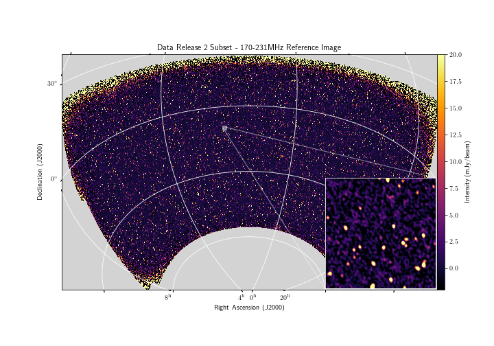

#This version is deprecated, please go here for the udpated version: 
https://github.com/GLEAM-X/GLEAM-X-pipeline

#GLEAM-X-pipeline
The goal of this pipeline is to reduce the data observed as part of the GLEAM-X project (G0008), but it is also applicable to many other MWA datasets. The pipeline was originally written for the Pawsey Magnus and Zeus systems, but has been adapted for compatibility with wider HPC systems. Software dependencies are built within a singularity container, which is subsequently used throughout the execution of the pipeline. It borrows significantly from the MWA-Fast-Transients pipeline written by Paul Hancock and Gemma Anderson: https://github.com/PaulHancock/MWA-fast-image-transients.

## Credits
If you use this code, or incorporate it into your own workflow, please cite [Hurley-Walker et al. 2022b](https://ui.adsabs.harvard.edu/abs/2022arXiv220412762H/abstract) and add a link to this repository.

## Overall design

<details>
<summary><b>Overall design details</b></summary>

The pipeline is divided into two main components. The first is a set of bash scripts that direct the processing of the pipeline, and the second is a set ofpython codes that implement specialised methods. 

Each stage within the pipeline has at least two bash scripts associated with it. One is a template script, which contains special placeholders which represent observation specific values. The second is a generating script. Based on user specifications, the generating script will adapt the template for processing, replacing the placeholder values with there actual values appropriate for processing. The mechanism used to do this substitution is a `sed` command within the generating script. In general, template scripts end in `tmpl` and are placed in the `templates` sub-directory, and the generating scripts have filenames beginning with either `obs` or `drift` and are placed in the `bin` directory. These `obs` and `drift` scripts are also responsible for submitting work to the SLURM scheduler. 

The python codes are stored under the `gleam_x` sub-directory in a structure that is `pip` installable, if required. These codes have been updated to `python3`. Although some effort has been made to maintain backwards compatibility with `python2`, this is not guaranteed. Many of these python codes are called as standard command line programs within the pipeline, and have python module dependencies that should be standardised. For this reason, the `gleam_x` python module is installed within the singularity container. When deploying the pipeline for use, it is _not_ necessary to `pip install` the python module within this repository so that it is accessible as part of the larger HPC environment. 

</details>

## Singularity container

<details>
<summary>
<b>Singularity container details</b>
</summary>

The GLEAM-X singularity container is built to contain all programs that are used throughout the GLEAM-X processing pipeline. The intent is that the singularity container is either built using the provided build script in `containers`folder, or a reference in made to an existing container (see next section). In brief, if the container needs to be built `singularity` has to be installed on a machine with admin privileges. The container would be built using a command similar to:

`sudo singularity build gleamx_container.img gleamx_build.txt`

Once the container is built it would need to be copied over to the HPC that the pipeline would be deployed on, and its path set via the `GXCONTAINER` variable in GLEAM-X profile script.

The build recipe for the singularity container is included under the `containers` folder. Unfortunately, the `mwa-reduce` is a critical dependency and is only accessible to members of the MWA collaboration. For this reason, it may not be possible to build the singularity container yourself. We are happy to distribute the container to anyone upon request. In a future release we plan on having the GLEAM-X singularity container automatically download alongside the data dependencies. 

Generated scripts are executed entirely within the singularity container context. This includes calls to `gleam_x` python scripts, which are bundled within the container. The `obs_*.sh` are executed on the host system (i.e. outside the container), and will submit the generated script to the slurm schedular for execution. When slrum allocates a resource, the submitted task will execute the generated work script within the GLEAM-X singularity container context. 

The GLEAM-X pipeline used upon the `SINGULARITY_BINDPATH` mechanism to describe the set of filesystem paths that should be included within an invoked singularity context. This is a supported mechanism by singularity. During the invocation of a profile script this `SINGULARITY_BINDPATH` variable is created with the properties set by the GLEAM-X configuration described within the profile script. If this environment variable is mangled or reset by other operations then submitted tasks might fail in unexpected ways. 

</details>

## Pipeline configuration
The pipeline is configured through the use of a 'profile' script, which contains the important components that describe aspects like:
- location of scratch disk
- location of where to save logs and generated scripts
- compute node properties (number of CPUs and memory)
- slurm cluster and queue details for long running copy jobs
- location of GLEAM-X singularity container

Each environemtn parameter begins with `GX` to denote its relation to the GLEAM-X pipeline. Throughout all tasks there is the expectation that these variables are present. Examples of these GLEAM-X profiles are provided under the `example_profiles` folder of this repository. 

## Structure of pipeline

<details>
<summary><b>Structure of pipeline details</b></summary>

Code directory:
- bin: contains the bash scripts that generate files for execution
- templates: the template bash scripts that are used as the basis to generate submittable scripts
- containers: a container related space, currently containing the build script for the singularity container for reference
- models: Sky model files, including the Global GLEAM Sky Model which is extensively used throughout the pipeline
- mosaics: Template files used to instruct `SWarp` image co-adding
- gleam_x: Python module containing the GLEAM-X python code 
- utilities: Bespoke scripts used for isolated problems that should be preserved for prosperity

In the base path there are two files of importance:
- setup.py: file that allows for `gleam_x` to be installed as a python module
- GLEAM-X-pipeline-template.profile: a template of the GLEAM-X configuration

</details>

## Meta-data tracking database 

<details>
<summary><b>Meta-data tracking database details</b></summary>

If you are not planning on using the meta-data tracking component of the GLEAM-X pipeline, simply set `export GXTRACK='no'` in your GLEAM-X profile script and you can largely ignore this subsection. If unsure, read on. 

This `track_task.py` script is used throughout the pipeline to record properties of submitted tasks in a mySQL database. For submitted tasks it tracks things like:
- start and finish times 
- exit status
- task log location
- obsid task operated against
- project task operated against. 

Separately to tracking tasks, the database will also maintain a record of the state of individual obsids and their corresponding properties. These details are inserted into the database using `gleam_x/db/import_observations_from_db.py`. Given a list of obsids, this script will iteratively obtain corresponding meta-data from MWA web-services and insert them into the GLEAM-X database. If a task is submitted and is operating against an obsid not inserted into the GLEAM-X database there will be an error raised.

A separate mySQL server needs to be created, with an appropriate database schema and user authentication details, established. That is to say, the `track_task.py` script does _not_ create a database with an appropriate schema on first use. The database tables should be created using the `make_db.py` located within the `gleam_x/db` directory. Additionally, the `track_task.py` script will only execute correctly if account details required to authenticate against the mySQL server are set as GLEAM-X environment variables. If these details aren't provided (or the tracking has been disabled), `track_task.py` will simply exit with a small message. 

`track_task.py` is a script distributed with the `gleam_x` python module that makes up a component of this repository and is not intended for use outside of these scripts. The tracking behaviour is only enabled when `GXTRACK='track'`. If no tracking is required (for example, when processing an obsid that is not part of the G0008 project) then this variable should be set to anything other than `'track'`. 

For GLEAM-X use the following environment parameters (using `export`) should be set so that they can be picked up by `track_task.py`:
- `GXDBHOST` -- IP or resolvable hostname of the machine running the mySQL GLEAM-X database
- `GXDBPORT` -- The port number that the mySQL service is listening on
- `GXDBUSER` -- User name with write access to the GLEAM-X database
- `GXDBPASS` -- User password with write access to the GLEAM-X database

Generally, the account details can be obtained through a project member, and should be saved in a secure file specified by the `GXSECRETS` file (see below).

</details>

## Template configuration script

<details>
<summary><b>Template configuration script details</b></summary>

We provide `GLEAM-X-pipeline-template.profile` as an example configuration file that needs to be updated for the exact HPC system the GLEAM-X pipeline is being deployed on. Each environment variable also carries with it a brief description of its purporse and expected form.

When running the completed template file for the first time, a set of folders are created, and data dependencies are automatically downloaded. This should be a 'one-and-done' operation, but if locations are updated at a later time (or are accidently deleted) they would be redownloaded the next time the profile script is executed.

It will be necessary to `source` the completed template file before running any of the GLEAM-X scripts. This will export all GLEAM-X configurables into the environment of spawned processes, which are in turn passed along to submitted slurm tasks. 

The template example configuration profile also references a secrets file. It is intended that this file (which is not included in this repository) would contain user authentication details required for aspects of the pipeline, including the downloading of MWA data from ASVO and authentication against the mysql database (see above). This file is intentionally not included in this repository in an effort to ensure secrets are not accidently commited and made available. When created it should be set to have secure permissions, ie. `chmod700 gxsecrets_file.profile`. 

</details>

## Steps to deploy
The following steps should install the pipeline for use on a HPC system with a slurm schedular:
1. `git clone` this repository
2. Copy the `GLEAM-X-pipeline-template.profile` file (e.g. `cp GLEAM-X-pipeline-template.profile GLEAM-X-pipeline-hpc.profile`), and edit based on the desired system configuration using the text editor of your choice. For reference we include some exampled in the `example_profiles` directory. Care should be taken to ensure that they reflect the HPC configuration of each user
3. Build the singularity container (if you have access to the `mwa-reduce` repository), or contact a member of the group for the current container, and update the ``GXCONTAINER`` environment variable to point to its location
4. Run the configuration file to create directories and download data dependencies, e.g. `source GLEAM-X-pipeline-hpc.pipeline`
5. If archiving to the GLEAM-X data-store (see the next subsection) reach out to a GLEAM-X member for further details

All compiled software is already prebuilt in the singularity container. There is no need to install any python modules on the host system, as all python code is executed within the context of the singularity container. Provided that singularity is installed, slurm is installed and you have a copy of the singularity container -- it should just work provided a correct configuration profile (famous last words).

The pipeline expects that a completed configuration profile and has been completed and loaded (using `source`) before running any of the associated `obs_*.sh` or `drift_*.sh` scripts. It is recommended that you `source` the completed configuration file in your `bash_profile`, so that it is loaded on login. *A word of warning*. If you adopt this approach and your home directory (where `bash_profile` usually resides) is shared among multiple clusters, special care should be taken to ensure you `source` the correct profile. Depending on the SLURM configuration and the compute node specifications, it is entirely possible that configuration profiles are not interchangeable between HPC environments, particuarly if SLURM jobs are requesting resources that the compute node are not capable of supporting. 

<details>
<summary><b>Other small installation notes</b></summary>

### Data dependencies

The pipeline requires two data products to be downloaded:

- The MWA [Fully Embedded Element Beam](http://cerberus.mwa128t.org/mwa_full_embedded_element_pattern.h5): A HDF5 file containing the MWA FEE beam, which is used in some tooling (`calibrate`) to evaluate the instrumental response towards a particular direction at a particular frequency
- [Pre-computed MWA primary beams](https://cloudstor.aarnet.edu.au/plus/s/77FRhCpXFqiTq1H/download): A HDF5 file containing the FEE beam evaluated towards every MWA grid position for every frequency, which is used by a python [mwa_pb_lookup]([https://github.com/johnsmorgan/mwa_pb_lookup) module to quickly evaluate the primary beam by using the precompute and saved response (with interpolation in the spatial and frequency dimensions when required)

These are automatically downloaded by the example profile scripts if they do not exist in the deployed GLEAM-X pipeline folder. Be aware though that they are downloaded and extracted in the working directory when the profile script is executed before being moved into place. Depending on the HPC environment and set up this might result in 'disk quota' issues, particularly if running from `$HOME`. 


### SSH keys and archiving
The GLEAM-X team have secured an ongoing archive at [Data Central](https://datacentral.org.au/) that is used to save completed pipeline data products. These are copied as part of an archive stage using a numbus instance as a tunnel. To successfully run this stage your public ssh key has to be approved and stored as an allowed user. Reach out to one of the GLEAM-X members for assistance. 

As a note - within the Pawsey system it has been found that the singularity container is not able to consistently bind to the home directory of the user, meaning that the users default ssh credentials are not accessible. For this reason the current suggestion is to create a ssh keypair specific to the GLEAM-X pipeline. The ideal location would be with $GXBASE directory, however any path would be acceptable if you have read/write permission. Creating the ssh keypair is not part of the current version of the configuration template, but such a keypair can be created with 

`ssh-keygen -t rsa -f "${GXBASE}/ssh_keys/gx_${GXUSER}"` 

after the GLEAM-X configuration profile has been loaded. The archive stage expects the key to follow a `gx_${GXUSER}` format. This may change in a future release. 

Archiving data to Data Central is a two step process. Step one is to run `drift_archive_prep.sh`, which will iterate over a collection of obsids and prepare them for copying. This includes clipping and zipping model component files, and applying `SR6` to background and noise maps. Step two is to run `drift_transfer.sh`, which will then iterate over each obsid and copy desired files (using a SSHFS mount on the meta-data server) over to Data Central. 

</details>

## Example workflow

A typical workflow might look like:
   - Look on the MWA metadata pages for a set of observations of interest: http://ws.mwatelescope.org/admin/observation/observationsetting/ or http://ws.mwatelescope.org/metadata/find
   - Download the list of observation IDs to a text file
   - Go to your configured scratch space (`cd "$GXSCRATCH"`) and create a project directory with whatever pithy name you feel is appropriate
   - Put the text file there, and then run obs_manta.sh on it to download that list of observations
   - Once they have downloaded, for each observation, run `obs_autoflag.sh` and `obs_autocal.sh`
   - Look at the calibraton solutions, and if they generally look OK, for each observation, run `obs_apply_cal.sh` to apply them. There is a helper script (`check_assign_solutions.py`) that aims to select an optimal calibration solution for each obsid
   - Run `obs_uvflag.sh` to flag potential RFI
   - Run some deep imaging via `obs_image.sh`
   - Run the post-imaging processing via `obs_postimage.sh` to perform source-finding, ionospheric de-warping, and flux density scaling to GLEAM.

The approach outlined above would produce a single snapshot image. If the intent it to produce a night-long mosaic then two extra tasks should be applied against sets of obsids grouped by frequency. These steps are:
- aggregating bright source information and comparing to the GGSM and applying a final spatially varying flux scaling correction via `drift_rescale.sh`, see below
- coadding final images into deep co-added images via `drift_mosaic.sh`

## Detailed script descriptions
<details>
<summary>
<b>check_assign_solutions.py to select calibration solutions</b>
</summary>

GLEAM-X will direct the main response of the MWA towards a particular direction, and let the sky drift through it as the Earth rotates, and over the processing run will cycle through five frequency configurations. In typical procressing the GLEAM-X pipeline uses an in-field sky model to calibrate each obsid. In some cases this process does not converge to an optimal solution, with common causes being an especially bad ionosphere, or bright sources residing in a location of the primary beam with an especially chromatic response (or in a location with a poorly modeled primary beam response). In these cases we attempt to identify calibration solutions from an obsid nearby in time and at the same frequency. 

When in `assign` mode the `check_assign_solutions.py` will accept a new-line delimited text file of obsids, search for each of their associated calibration solution files, evaluate them, and then assign each obsid a calid -- an obsid whose calibration solutions should be used for the subject obsid. A typical example is:

`check_assign_solutions.py -t 0.25 assign XG_D-27_20180220.txt`

In this example, each calibration solution must have no more than 25% of its contents flagged (i.e. did not calibrate). The solution file contents a 2x2 Jones matrix per antenna per channel per timestep. In the current version of `check_assign_solutions.py`, edge channels flagged automatically are not included as part of the threshold statistics (although can be included with `--include-edge-channels`). 

A slightly more advanced invocation (which is now used in typical processing) is:

`check_assign_solutions.py -t 0.25 --segments 4 --segment-threshold 0.25 assign XG_D-27_20180220.txt --calids-out XG_D-27_20180220_calids.txt --only-calids`

In this example the 768 channels that make up a GLEAM-X measurement set are divided into 4 chunks, and each chunk is also checked in isolate to ensure that there is sufficent data (no more than 25% flagged). A separate new-line delimited text file `XG_D-27_20180220_calids.txt` is created that describes the calid to use for each obsid listed in `XG_D-27_20180220.txt`. 

The GLEAM-X meta-data server is used to obtain the frequency of each presented obsid, which is used when determining which calibration solution should be assigned to a subject obsid. Therefore, this script should only be used when:

1) the environment has been set up to allow communication with the mySQL server running on the nimbus vurtual machine,
2) the obsids are GLEAM-X observations which have been imported into the database. Note that this is not done automatically in typical processing, rathre it is done by an admin on the nimbus machine.

The hope is that once calids have been assigned to each obsid described in a file (`XG_D-27_20180220.txt`), then the `obs_apply_cal.sh` task may be used as:

`obs_apply_cal.sh -p project -c XG_D-27_20180220_calids.txt XG_D-27_20180220.txt`

</details>

<details>
<summary>
<b>A few small notes on using tasks</b>
</summary>

#### Specifying obsids
Most `obs_*.sh` style tasks have two ways of specifying which obsids to operate against. 

The first is simplying invoking the task with the obsid of interest on the command line, ie. `obs_autocal.sh -p test_project 1234568762`. This task will then look for the obsid folder (which in this example would be `"$GXSCRATCH/test_project/1234568762"`), and the submitted worker script will switch to it before carrying out any operations. 

If multiple obsids want to be specified for a single task (which is the typical suggested workflow when processing a night of data), then a new-line delimited text file of obsids may be created. When calling a task, the name of this text file should be specified inplace of a single obsid. Internally, tasks will create a job-array, where each obsid described by this new-line delimieted file are processed as a separate slurm job. 

#### Dependency chaining
Most tasks have a `-d` option, which will allow a slurm job-id to be passed, and included as a dependency when submitting a new slurm job. That is to say, an instruction is given to the slurm schedular to wait for a previously submitted task to finish before commencing work. Attempts are made to use the appropriate slurm directive that distinguishes between chaining work before a single obsid or a job-array of obsids. 

Although this 'technically' works in that an error is not immediatedly issued by the slurm schedular when a task is submitted, in practise it was found that in the job-array case some task-ids (elements of job-array) would fail to execute. This was happening in a un-predictable manner. It is suggested that this mode of operation be observed closely if invoked. 
</details>

<details>
<summary>
<b>Important task descriptions</b>
</summary>

### obs_manta.sh
Use the [ASVO-mwa](https://asvo.mwatelescope.org) service to do the cotter conversion and then download the resulting measurement set. No matter which cluster the jobs are submitted from, they will always run on the copy queue specified in the user profile script. On Pawsey systems this is typical the `Zeus` cluster's `copyq` queue.

usage:
```
obs_manta.sh [-p project] [-d dep] [-q queue] [-s timeave] [-k freqav] [-t] -o list_of_observations.txt
  -d dep      : job number for dependency (afterok)
  -q queue    : job queue, default=copyq
  -p project  : project, (must be specified, no default)
  -s timeav   : time averaging in sec. default = 4 s
  -k freqav   : freq averaging in KHz. default = 40 kHz
  -t          : test. Don't submit job, just make the batch file
                and then return the submission command
  -o obslist  : the list of obsids to process
```
uses templates:
- `manta.tmpl` (obsnum->OBSNUM/timeav->TRES/freqav->FRES)

### obs_autocal.sh
Generate calibration solutions for a given observation using the GLEAM-based sky model in the GLEAM-X-pipeline/models directory.

Usage:
```
obs_autocal.sh [-d dep] [-q queue] [-t] obsnum
  -p project : project, no default
  -d dep     : job number for dependency (afterok)
  -q queue   : job queue, default=workq
  -t         : test. Don't submit job, just make the batch file
               and then return the submission command
  obsnum     : the obsid to process
```

uses templates:
- `autocal.tmpl`
  - creates 3 time-step calibration solutions and compares them using aocal_diff.py to check the ionospheric variation. If configured these results are recorded in the GLEAM-X database, but otherwise nothing else is done with them to inform/modify the processing flow control
  - creates a single time-step calibration solution like: `<obsnum>_<calmodel>_solutions_initial.bin`
  - plots the calibration solutions

### obs_apply_cal.sh
Apply a pre-existing calibration solution to a measurement set.

Usage:
```
obs_apply_cal.sh [-p project] [-d dep] [-q queue] [-c calid] [-t] [-n] obsnum
  -p project  : project, no default
  -d dep      : job number for dependency (afterok)
  -q queue    : job queue, default=gpuq
  -c calid    : obsid for calibrator.
                project/calid/calid_*_solutions.bin will be used
                to calibrate if it exists, otherwise job will fail.
  -t          : test. Don't submit job, just make the batch file
                and then return the submission command
  obsnum      : the obsid to process
```

uses templates:
- `apply_cal.tmpl` (obsnum->OBSNUM, cal->CALOBSID)
  - applies the calibration solution from one data set to another

### obs_uvflag.sh
Scan the visibility data and flag for RFI

Usage:
```
obs_uvflag.sh [-p project] [-d dep] [-a account] [-z] [-t] obsnum
  -p project : project, no default
  -d dep     : job number for dependency (afterok)
  -z         : Debugging mode: flag the CORRECTED_DATA column
                instead of flagging the DATA column
  -t         : test. Don't submit job, just make the batch file
               and then return the submission command
  obsnum     : the obsid to process, or a text file of obsids (newline separated). 
               A job-array task will be submitted to process the collection of obsids. 
```
uses templates:
  - `uvflag.tmpl`
    - scans the visibility data and fits a trend as a function of uv-distance
    - visibilities outside a running mean/std region are flagged
    - uses a python script (`ms_flag_by_uvdist.py`) that is distributed with the `gleam_x` python module

### obs_uvsub.sh
Will invoke a simple procedure to attempt to remove bright A-Team sources predicted to be just outside an image field-of-view from the visibilitities within a measurement set. The procedure will create small images around A-Team sources, clean them in XX and YY telescope polarisations across a high number of sub-bands, and then subtract the model visibilities from the data. If there is more than one A-Team source with sufficently bright (after estimating telescope response) then they will each be visited. 

Usage:
```
obs_uvsub.sh [-d dep] [-a account] [-t] obsnum
  -p project : project, no default
  -d dep     : job number for dependency (afterok)
  -t         : test. Don't submit job, just make the batch file
               and then return the submission command
  -z         : Debug mode, so adjusts the CORRECTED_DATA column
  obsnum     : the obsid to process, or a text file of obsids (newline separated). 
               A job-array task will be submitted to process the collection of obsids. 
```
uses template:
  - `uvsub.tmpl`
    - `generate_ateam_subtract_model.py` will check for difficult A-Team sources and generate a script for execution
    - generated script perform `chgcenter` as necessary throughout the processing

### obs_image.sh
Image a single observation.

Usage: 
```
obs_image.sh [-d dep] [-p project] [-q queue] [-t] obsnum
  -d dep     : job number for dependency (afterok)
  -q queue   : job queue, default=workq
  -p project : project, (must be specified, no default)
  -t         : test. Don't submit job, just make the batch file
               and then return the submission command
  obsnum     : the obsid to process
```
uses templates:
- `image.tmpl`
  - Make four channels and an MFS image
  - Stokes I
  - Joined-channel clean
  - Auto-mask 3-sigma; auto-threshold 1-sigma

### obs_postimage.sh
Perform post-imaging correction on a image, including corrections to account for the distortion of the ionosphere. 

Usage:
```
obs_postimage.sh [-d dep] [-p project] [-a account] [-t] obsnum
  -d dep     : job number for dependency (afterok)
  -p project : project, (must be specified, no default)
  -t         : test. Don't submit job, just make the batch file
               and then return the submission command
  obsnum     : the obsid to process, or a text file of obsids (newline separated). 
               A job-array task will be submitted to process the collection of obsids.
```
uses templates:
  - `postimage.tmpl`
    - performs an `aegean` to perform source finding
    - `fits_warp` and `flux_warp` correct the image for effects of ionosphere
    - source finding is performed again on the corrected image

### obs_transient.sh
Will produce time-step images after subtracts the deep clean model generated by `obs_image.sh`. These time-step images are saved to be searched later for long-period transient objects; see (Hurley-Walker et al. 2022)[https://ui.adsabs.harvard.edu/abs/2022Natur.601..526H/abstract].

```
obs_transient.sh [-d dep] [-p project] [-z] [-t] obsnum
  -d dep     : job number for dependency (afterok)
  -p project : project, (must be specified, no default)
  -z         : Debugging mode: image the CORRECTED_DATA column
                instead of imaging the DATA column
  -t         : test. Don't submit job, just make the batch file
               and then return the submission command
  obsnum     : the obsid to process, or a text file of obsids (newline separated). 
               A job-array task will be submitted to process the collection of obsids. 
```
uses template:
  - `transient.tmpl`

### obs_binoc.sh
Will divide a measurement set up into four quadrants (north, south, east and west), each of which are imaged and catalogued separately. The resulting catalogues are saved for ionospheric analysis. 

```
obs_binoc.sh [-d dep] [-p project] [-a account] [-z] [-t] obsnum
  -d dep     : job number for dependency (afterok)
  -p project : project, (must be specified, no default)
  -z         : Debugging mode: image the CORRECTED_DATA column
                instead of imaging the DATA column
  -t         : test. Don't submit job, just make the batch file
               and then return the submission command
  obsnum     : the obsid to process, or a text file of obsids (newline separated). 
               A job-array task will be submitted to process the collection of obsids. 
```
uses templates:
  - `binoc.tmpl`
    - will make a copy of a measurement set for each direction, which is then flagged, imaged and deleted

### obs_zip_ms.sh
Will compress a measurement set into a single zip file. This is useful for HPC environments with inode quotas, as a single measurement set is actually comprised of many sub-folders and files.

Usage:
```
obs_zip_ms.sh [-d dep] [-p project] [-a account] [-u user] [-t] obsnum

Zips the measurement set in each obs directory in order to reduce the number of individual files being tracked by a file system. Useful for cases where filesystems have quota limits.

By default the measurement set will be compressed and then removed. The reverse operation is supported. 

  -d dep      : job number for dependency (afterok)
  -p project  : project, (must be specified, no default)
  -u          : unzip the previously compressed measurement set (default: False)
  -t          : test. Don't submit job, just make the batch file
                and then return the submission command
  obsnum      : the obsid to process, or a text file of obsids (newline separated). 
               A job-array task will be submitted to process the collection of obsids.
```
uses templates:
  - `zip_ms.tmpl`
      - will use `zip` for compression and `unzip` for decompression
      - if compression/decompression completed successfully then the original file is deleted
      - if decompressing a measurement set, the creation date-time stamp is updated to avoid file purge systems from activating and deleting 'old' files.

### obs_zip_folder.sh
Will compress an obsid folder and the entirity of its contents into a single zip file. This is useful on HPC system with inode quotas. 

Usage:
```
obs_zip_folder.sh [-d dep] [-p project] [-a account] [-u user] [-t] obsnum

Zips an entire obsid folder and its contents in order to reduce the number of individual files being tracked by a file system. Useful for cases where filesystems have quota limits.

By default the obsid folder will be compressed and then removed. The reverse operation is supported. 

  -d dep      : job number for dependency (afterok)
  -p project  : project, (must be specified, no default)
  -u          : unzip the previously compressed observation folder (default: False)
  -t          : test. Don't submit job, just make the batch file
                and then return the submission command
  obsnum      : the obsid to process, or a text file of obsids (newline separated). 
               A job-array task will be submitted to process the collection of obsids.
```
uses templates:
  - `zip_folder.tmpl`
      - will use `zip` for compression and `unzip` for decompression
      - if compression/decompression completed successfully then the original file is deleted
      - if decompressing a measurement set, the creation date-time stamp is updated to avoid file purge systems from activating and deleting 'old' files.

### obs_tar_folder.sh
Similar to `obs_zip_folder.sh` above, but uses `tar` inplace of `zip/unzip`, which can significantly accelerate the operation. Also has an `untar` option to expand a previously `tar`ed obsid folder. Creation date-time stamps are updated to avoid filesystem purge policies from being invoked. 

Usage:
```
obs_tar_folder.sh [-d dep] [-p project] [-a account] [-u user] [-t] obsnum

Tars an entire obsid folder and its contents in order to reduce the number of individual files being tracked by a file system. Useful for cases where filesystems have quota limits.

By default the obsid folder will be tarred (no compression) and then removed. The reverse operation is supported. 

  -d dep      : job number for dependency (afterok)
  -p project  : project, (must be specified, no default)
  -u          : un-tar the previously tarred observation folder (default: False)
  -t          : test. Don't submit job, just make the batch file
                and then return the submission command
  obsnum      : the obsid to process, or a text file of obsids (newline separated). 
               A job-array task will be submitted to process the collection of obsids. 
```
uses template:
  - `tar_folder.tmpl`
    - Will delete the starting data if the operation has been completed successfully

### drift_rescale.sh
Given a set of obsids which share the same central frequency, the sources detected in each obsid will be aggregated and compared to the Global GLEAM Sky Model to search and correct any low level positional flux inaccuracies. This will produce a new set of image and catalogue files in each obsid folder, as well as a set of catalogue fits files in the project directory. 

This code does not separate out obsids into groups based on their frequency. Instead, `obsid_ops.py obsid_list.txt split` could be used to output five new obsid lists group by central observing frequency. In typical GLEAM-X processing this task would be called five times -- once for each central frequency. 

Usage:
```
drift_rescale.sh [-p project] [-d dep] [-b projectpsf] [-a account] [-t] [-r] [-e dec] -o list_of_observations.txt
  -p project  : project, (must be specified, no default)
  -d dep     : job number for dependency (afterok)
  -t          : test. Don't submit job, just make the batch file
                and then return the submission command
  -r read : read existing solutions instead of writing new ones
  -b projpsf : the path to the projpsf_psf.fits data producted produced by drift_mosaic.sh. Used to identify obsids with high blur factors
  -o obslist  : the list of obsids to process
```
uses template:
  - `rescale.tmpl`
    - For each tasks, a job-array of length five is used to process the four 7.68MHz sub-bands and wide 30MHz band images/catalogues 

### drift_mosaic.sh
Given a set of obsids which share the same central frequency, their corresponding rescaled images are reinterpolated onto a common pixel grid and combined using `swarp`. In typical GLEAM-X processing this task would be called five times -- once for each group of obsids belonging to a single central frequency. 

Usage:
```
drift_mosaic.sh [-p project] [-d dep] [-q queue] [-a account] [-t] [-f] [-r ra] [-e dec] -o list_of_observations.txt
  -p project  : project, (must be specified, no default)
  -d dep      : job number for dependency (afterok)
  -t          : test. Don't submit job, just make the batch file
                and then return the submission command
  -f          : Use the data products produced by the filtered rescaling, which has 
                observations with high blur factors. This will only work if the 
                drift_rescale.sh task has been processed with a supplied -b psf option.  
  -r RA       : Right Ascension (decimal hours; default = guess from observation list)
  -e dec      : Declination (decimal degrees; default = guess from observation list)
  -m mosaicdir: Directory name for mosaics to be created (default=mosaic) 
  -o obslist  : the list of obsids to process
```
uses template:
  - `mosaic.tmpl`
    - An optimal position will be estimated using `calc_mean_pos.py`, attempting to minimise co-added image size and account for ZEA projection effects

### drift_night_coadd.sh
Task to combined night long mosaics that have already been processed using `drift_mosaic.sh`. 

Unlike most tasks, which operate on either a single obsid or a list of obsids specified in a text file, this task requires a list of directories that contain the outputs of `drift_mosaic.sh`/`mosaic.tmpl` to be specified. Internally to `drift_night_coadd.sh`, a job-array of length 25 is formed to attempt to add each sub-band and wide-band image together. The submitted work script attempts to ignore the component of the filename corresponding to each of the night-line mosaic names. 

Usage:
```
drift_night_coadd.sh [-p project] [-d dep] [-q queue] [-a account] [-t] [-r ra] [-e dec] list_of_nights.txt

Task to combine mosaics that have been produced by 'drift_mosaic.sh' into a single, larger image. The contents of
list_of_nights should be directed to the adopted mosaic folder for each nigh, incase a non-default 'mosaic' folder
name was used.

  -p project  : project, (must be specified, no default)
  -d dep     : job number for dependency (afterok)
  -t          : test. Don't submit job, just make the batch file
                and then return the submission command
  -r RA       : Right Ascension (decimal hours; default = guess from observation list)
  -e dec      : Declination (decimal degrees; default = guess from observation list)
  -m mosaicdir: Directory name for mosaics to be created (default = mosaics) 
  nightlist  : the list of nights with existing coadded images to process
```
uses template:
  - `nightcoadd.tmpl`
    - Relies on glob expression to extract the appropriate set of images to coadded in cases with the project name component of images changes
    - Copies of images are made before they are co-added (aside: symlinks were originally used but sometimes might not be bound to properly when singularity is called)

### drift_archive_prep.sh
This will prepare data components for long term archive at Data Central. This stage will
- compress measurement sets
- extract a region of the PSF / dirty beam
- clip and compress model component files
- perform lossy compress of some smoothly varying files (rms/bkg)

Usage:
```
drift_archive_prep.sh [-d dep] [-p project] [-t] obsnum

Prepares data products for eachobsid for archiving. This involves zipping and cropping certain data products, and moving them into place. This will NOT initiate the transfer to a remote endpoint. 

A SLURM job-array will be used to prepare separate obsids in parallel. 

  -d dep      : job number for dependency (afterok)
  -p project  : project, (must be specified, no default)
  -t          : test. Don't submit job, just make the batch file
                and then return the submission command
  -o obsnum   : A text file of obsids (newline separated). 
                A job-array task will be submitted to process the collection of obsids.
```
uses template:
  - `darchive.tmpl`

### drift_transfer.sh
Copies selected GLEAM-X data products over to the Data Central archive. This isrequired only for those doing bulk processing of data directly related to G0008. 

Usage:
```
drift_archive.sh [-d dep] [-p project] [-a account] [-u user] [-e endpoint] [-r remote_directory] [-q port] [-t] obsnum

Will rsync files over to a remote end point. It is expected that items have already been packaged for transfer by running drift_archive_prep.sh

Only a single process will be invoked for all obsids. There is no attempt to multi-process. 

  -d dep      : job number for dependency (afterok)
  -p project  : project, (must be specified, no default)
  -u user     : user name of system to archive to (default: '$user')
  -e endpoint : hostname to copy the archive data to (default: '$endpoint')
  -r remote   : remote directory to copy files to (default: '$remote')
  -t          : test. Don't submit job, just make the batch file
                and then return the submission command
  -o obsnum   : A text file of obsids (newline separated).  
  -q port     : The port number for rsync to use. (default: 22)
```

uses templates:
  - `transfer.tmpl`
    - requires access to GLEAM-X nimbus instance

</details>



